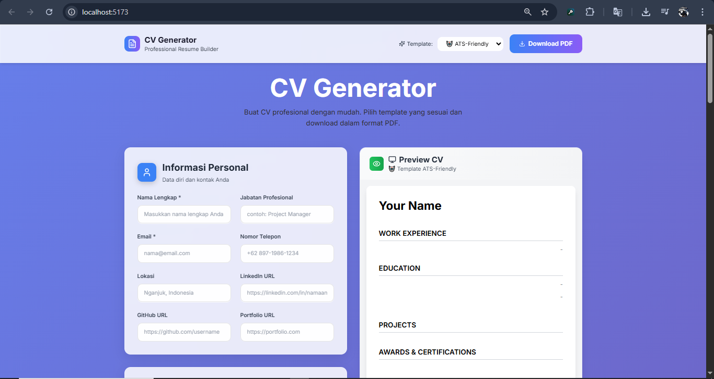

# 📄 CV Generator

**CV Generator** adalah aplikasi web untuk membuat CV profesional secara cepat dan mudah. Pengguna dapat mengisi data pribadi, pengalaman kerja, pendidikan, proyek, sertifikasi, dan keterampilan, kemudian mengunduh CV dalam format **PDF** dengan tampilan template yang menarik dan ATS-friendly.

## 🚀 Fitur Utama
- **Formulir Dinamis** untuk mengisi data personal, pengalaman kerja, pendidikan, proyek, penghargaan, dan keterampilan.
- **Preview Real-Time**: Perubahan pada formulir langsung terlihat pada pratinjau CV.
- **Template ATS-Friendly** agar mudah dibaca oleh sistem rekrutmen otomatis.
- **Export PDF** dengan satu klik.
- **Validasi Form** untuk memastikan data yang dimasukkan benar.
- **Desain Responsif** dan modern, dapat diakses dari berbagai perangkat.

## 🖼 Tampilan Aplikasi


## 📂 Struktur Proyek
```
cv-generator/
├── public/
│   ├── CV_Generator.png       
│   ├── CV.svg
├── src/
│   ├── assets/                
│   ├── components/
│   │   ├── forms/             
│   │   │   ├── PersonalInfoForm.jsx
│   │   │   ├── EducationForm.jsx
│   │   │   ├── ExperienceForm.jsx
│   │   │   ├── SkillsForm.jsx
│   │   │   ├── AwardsForm.jsx
│   │   │   ├── ProjectsForm.jsx
│   ├── App.jsx
│   ├── main.jsx
├── package.json
├── README.md
```

## 🛠 Teknologi yang Digunakan
- **Frontend**: React + Vite
- **Styling**: CSS Modern (Custom style + Flexbox/Grid)
- **PDF Export**: jsPDF / html2canvas
- **Validation**: Custom Validation

## 📌 Cara Menggunakan
1. Isi semua data pada formulir mulai dari **Informasi Personal** hingga **Sertifikasi & Keterampilan**.
2. Lihat hasil di **Preview CV** secara real-time di sebelah kanan.
3. Pilih template jika tersedia.
4. Klik tombol **Download PDF** untuk menyimpan CV.

## 📄 Lisensi
Proyek ini menggunakan lisensi **MIT**. Silakan gunakan dan kembangkan sesuai kebutuhan.
